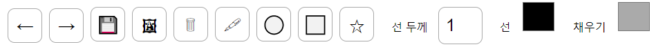

# 벡터 기반의 드로잉 툴 구현

## 사용 기술
- React
- Konva.js

## 구현 기술
#### 1. 드로잉 타입 선택 기능
- 펜
- 원
- 직사각형
- 별
#### 2. 드로잉 설정 기능
- 선 두께
- 선 색상
- 면 색상
- 지우개
#### 3. Undo, Redo

#### 4. 이미지 기능
- 이미지를 불러오기
- 이미지로 저장하기
- 이미지 위치 이동하기

#### 5. 구현 화면
##### 메뉴바

##### 사용 예시

